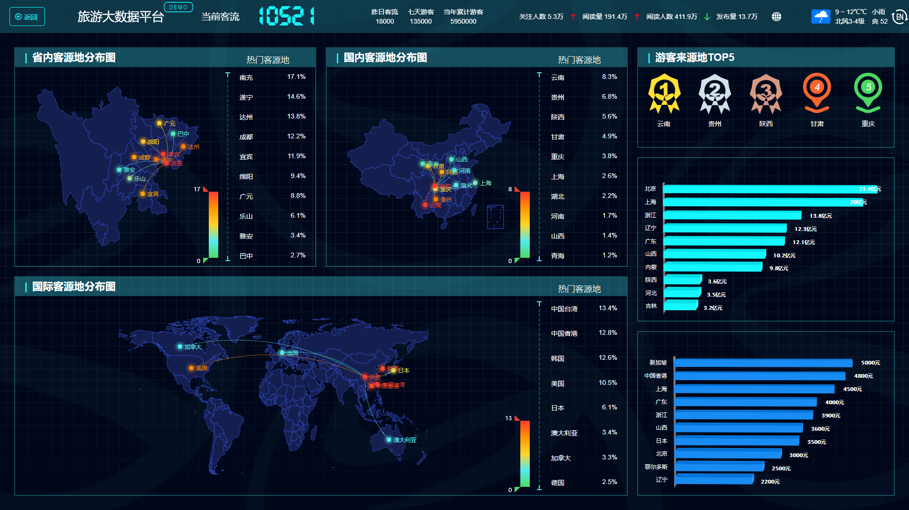
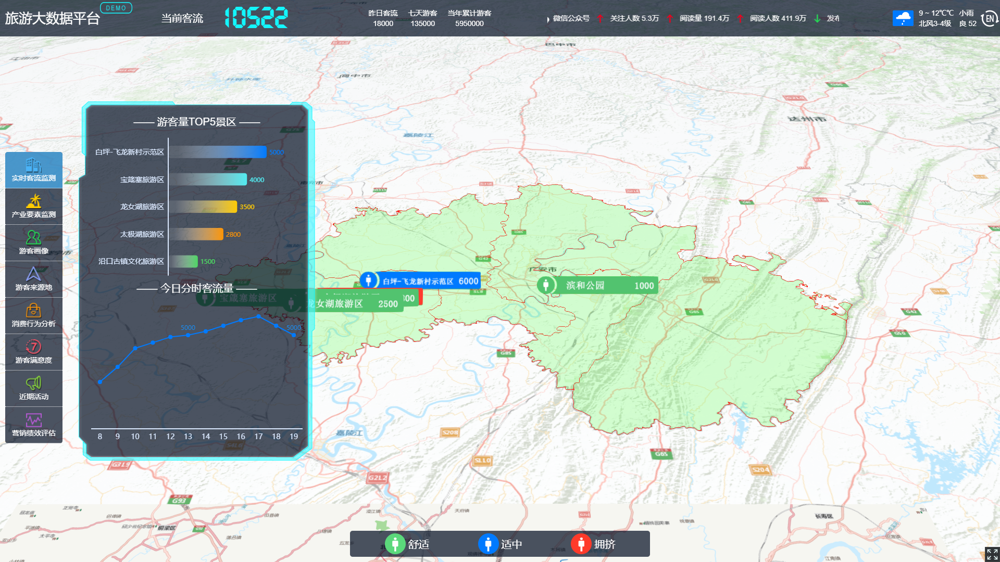
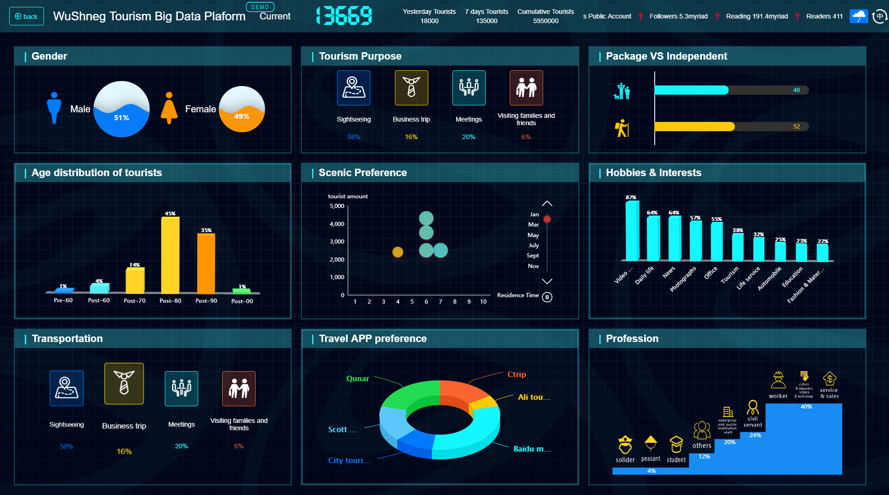

# 旅游Demo

>旅游大数据平台demo

## 使用到的插件
```
```
###1.Cesium.js：
```
`Cesium是国外一个基于JavaScript编写的使用WebGL的地图引擎。Cesium支持3D,2D,2.5D形式的地图展示，可以自行绘制图形，高亮区域，并提供良好的触摸支持，且支持绝大多数的浏览器和mobile。`
```
###2.highcharts.js
```
```
###3.echarts.js
```
```
###4.changeCood.js：
```
```
###5.element-ui：

```

```
###6.i18n：

```

```
## 示意图
 




